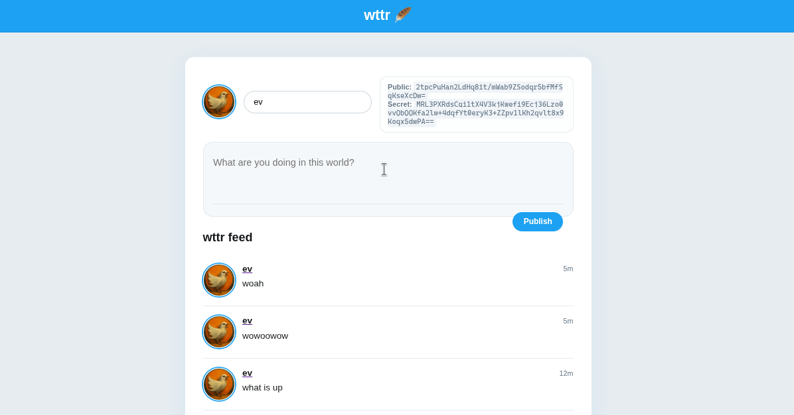

# wttr 🪶

wttr is a tiny microblogging experiment that pairs a lightweight Deno server with a purely client-side writer powered by [`apds`](https://github.com/evbogue/apds). It gives you a self-contained feed where every post is signed, stored, and rendered using APDS blobs, while the UI stays minimal thanks to HTMX.



## Features

- Identity pane that shows your APDS pub/secret keys, lets you rename yourself, and uploads a custom avatar by storing the image blob via APDS.
- Compose box that turns whatever you type into a signed APDS message (YAML blob) and ships it to the server as a single payload.
- Auto-refreshing global feed implemented with HTMX (`hx-get="/feed"` + `every 5s`) so new posts stream in without reloading the page.
- Profile, single-message, blob, and publish endpoints all handled by a ~200 line Deno server (`serve.js`) with no database — APDS is the storage.

## Stack

- **Runtime:** [Deno](https://deno.land/) (server + static hosting)
- **Client:** Vanilla JS (`app.js`) + [HTMX](https://htmx.org) for feed refresh
- **State/Storage:** [`apds`](https://github.com/evbogue/apds) for key management, signing, blob storage, and YAML parsing
- **Styling:** Single `style.css` file modeled after a classic microblog layout

## Getting Started

1. **Install Deno**  
   Follow https://deno.land/#installation (v1.40+ recommended).

2. **Run the server**
   ```sh
   deno run --allow-net --allow-read --allow-write serve.js
   ```
   The script boots APDS (`apds.start("wttr-server")`) and serves HTTP on `http://localhost:8000`.

3. **Open the UI**  
   Visit `http://localhost:8000` in a browser. The frontend (`app.js`) initializes its own APDS namespace (`wttr-lite`), derives or requests your keys, and begins rendering your identity panel.

## Usage Notes

- **Publishing:** Enter text, hit **Publish**, and the client calls `apds.compose()` to build/sign a YAML blob. The server stores the blob and signature, logs a summary, and the feed auto-refreshes.
- **Avatars:** Click the circular placeholder next to your name to pick an image. The client scales it down (≤256px), stores it as a base64 blob via `/blob`, and persists the hash in your APDS profile.
- **Feeds:**  
  - `/feed` – global timeline (also embedded on `/`)  
  - `/profile/:pubkey` – per-author filter using `apds.getOpenedLog()` metadata  
  - `/message/:hash` – permalink to a single message blob  
  - `/blob/:hash` – raw blob delivery (text or base64 image)

## Development Tips

- The project is framework-free, so live reloading is just a Deno restart. Use `deno run --watch --allow-net --allow-read --allow-write serve.js` while iterating locally.
- All storage is handled by APDS; there is no traditional database. If you reset the APDS data directory you lose the feed history.
- `app.js` is a standard ES module served to the browser. If you add additional modules, import them relatively (e.g., `./utils.js`).

## Status

Released under the MIT license (`LICENSE`). Still an experiment: read the code, run it locally, and adapt it for your own APDS tinkering.
